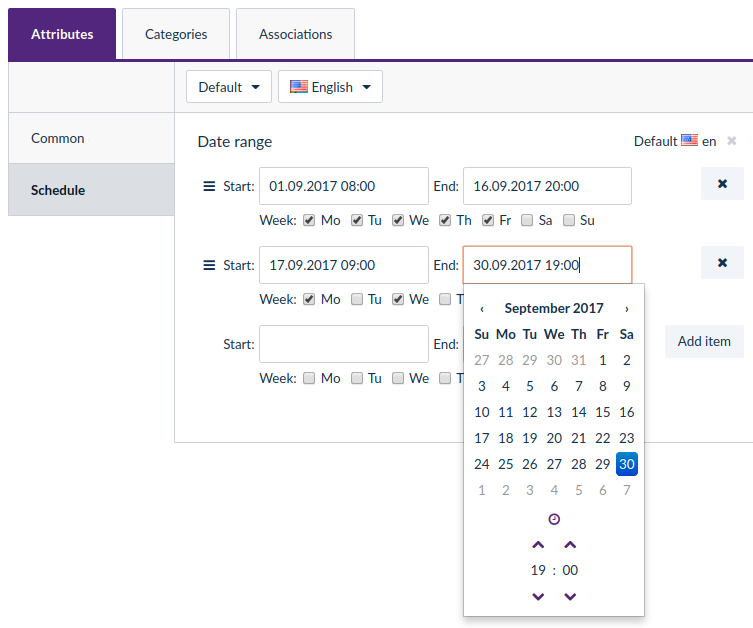

# DateCollectionTypeBundle

Provides new attributes types for Akeneo PIM:
- DateCollection: this attribute type can store an ordered collection of date ranges.


## Requirements

| DateCollectionTypeBundle | Akeneo PIM Community Edition |
|:---------------------------:|:----------------------------:|
| dev-master                  | v1.7.*                       |

## Installation
You can install this bundle with composer (see requirements section).

First, add the VCS then launch the following command from your root application:
```
    php composer.phar require --prefer-dist drugento/date-collection-type
```

Add the following bundle in your `app/AppKernel.php` file:

```php
$bundles = [
    new Pim\Bundle\DateCollectionTypeBundle\PimDateCollectionTypeBundle(),
];
```

## Configuration
You can read the detailed configuration documentation following thins link: [doc/index.md](doc/index.md)

## Contributing

If you want to contribute to this open-source project,
thank you to read and sign the following [contributor agreement](http://www.akeneo.com/contributor-license-agreement/)
